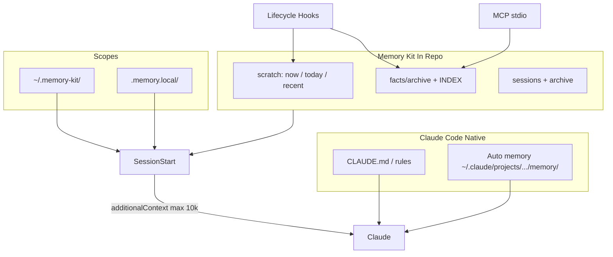

# Research: Cursor's claude-memory-kit design (verbatim capture)

## Why this research

Captured here verbatim as input to the spec-generator comparison. Cursor's design is notably tighter than ours: no LLM auto-extract, no vector search, no cron, fewer queues. Reading it forced us to revisit several decisions including MCP transport (we were wrong) and local-tier directory naming.

## Verbatim content

````markdown
# Design — memory-kit v0.1.0

## Architecture



## Comparison: three memory layers

| | CLAUDE.md | Auto memory | memory-kit |
|---|-----------|-------------|------------|
| Writer | Human | Claude | Human + explicit commands |
| Content | Instructions, conventions | Learnings, patterns | Durable facts with IDs |
| Location | Project / user / local md | `~/.claude/projects/<repo>/memory/` | `.memory/` (+ user/local dirs) |
| Git portable | Project files yes | No | Yes (project tier) |
| Session load | Full (eager) | MEMORY.md first 200 lines / 25KB | Hook digest ≤10k chars |
| Audit | Yes | Yes | Yes, per-fact files |

**Coexistence rules**

1. Never write auto memory paths unless user runs future `promote` command.
2. Do not set `autoMemoryDirectory` to project paths (Claude Code security policy).
3. Prefer `[mem:P-000042]` citations in prompts; Claude may still use auto memory for informal notes.
4. On conflict, **project fact file** wins for team truth; user may copy to CLAUDE.md as instruction.

---

## Directory layout

### Project (committed)

```
.memory/
  README.md
  config.yaml
  scratch/
    now.md
    today.md
    recent.md
  facts/
    INDEX.md
    archive/
      P-000001.md
  sessions/
    YYYY-MM-DD.md
    archive/
      YYYY-MM/
        summary-YYYYMMDD.md
  .meta/
    audit.log
  .cache/
    index.db          # regenerable FTS5
```

### Local (gitignored)

```
.memory.local/
  facts/archive/      # L-* IDs
  scratch/            # optional mirror
```

### User (global)

```
~/.memory-kit/
  config.yaml
  facts/archive/      # U-* IDs
  scratch/            # optional
```

---

## Fact schema

```yaml
---
id: P-000042
scope: project          # project | user | local
created: "2025-05-23"
updated: "2025-05-23"
tags: [auth, oauth]
retain: true
private: false
status: active          # active | archived
sources: []
supersedes: null
---

# Title (H1 optional, body freeform)

Fact body markdown.
```

**ID allocation:** monotonic numeric suffix per scope (`P-000043`), stored in `.memory/.meta/counters.json` (regenerable from archive scan).

**Tombstone:** `status: archived` + optional `archived_at`; file retained for audit.

---

## Scratch roll algorithm

```
function roll(end_of_session: bool, date: today):
  if end_of_session:
    append session one-liner to sessions/{date}.md
    merge scratch/now.md bullets into scratch/today.md
    clear scratch/now.md
    enforce_cap(today)

  if date changed since last_roll_date (stored in .meta/state.json):
    merge today → recent
    clear today
    enforce_cap(recent)
    if recent over cap after trim:
      spill oldest bullets → sessions/archive/{YYYY-MM}/summary-{date}.md
    update last_roll_date
```

**Cap enforcement:** split content by lines starting with `- `; drop oldest bullets until `len(content) <= max_chars`.

---

## Hook I/O contracts

### Common stdin (Claude Code)

Hooks read JSON from stdin. Used fields:

- `session_id`, `transcript_path`, `cwd`, `hook_event_name`
- Event-specific: `prompt`, `source`, `tool_name`, `tool_input`, `tool_response`, `reason`

### Common stdout (exit 0)

```json
{
  "hookSpecificOutput": {
    "hookEventName": "SessionStart",
    "additionalContext": "..."
  }
}
```

| Hook | Output | Notes |
|------|--------|-------|
| session-start | `additionalContext` | Digest ≤10,000 chars |
| prompt | `additionalContext` optional | After processing remember/forget |
| stop | none | Side effect only |
| session-end | none | Fast roll; timeout 3s in template |
| post-tool | none | Validate only; stderr on invalid schema |

### settings.json template

See `.memory-kit/templates/settings.hooks.json`.

Commands use:

```
python -m memory_kit hook <subcommand>
```

Or installed `memory-kit hook <subcommand>` when on PATH.

---

## MCP tool schemas

| Tool | Inputs | Returns |
|------|--------|---------|
| `memory_remember` | `text`, `scope?`, `title?`, `tags?` | `{ id, path }` |
| `memory_forget` | `id` | `{ id, status }` |
| `memory_get` | `id` | `{ id, frontmatter, body }` |
| `memory_search` | `query`, `limit?` | `{ hits: [{id, title, snippet}] }` |
| `memory_scratch` | `tier?` | `{ now, today, recent }` |

Transport: stdio JSON-RPC per MCP spec; implemented with minimal custom handler (no heavy SDK required for v0.1).

---

## FTS5 index schema

```sql
CREATE TABLE facts (
  id TEXT PRIMARY KEY,
  scope TEXT,
  title TEXT,
  body TEXT,
  tags TEXT,
  status TEXT,
  updated TEXT
);
CREATE VIRTUAL TABLE facts_fts USING fts5(
  id, title, body, tags,
  content='facts', content_rowid='rowid'
);
```

Rebuild: walk all `**/archive/*.md`, parse frontmatter, repopulate.

---

## Config (`config.yaml`)

```yaml
version: 1
scratch:
  max_chars:
    now: 4000
    today: 8000
    recent: 12000
digest:
  max_chars: 9500          # below Claude 10k hook cap
  max_facts: 20
extract:
  enforce_schema: false
  allowed_paths:
    - ".memory/"
```

---

## Migration notes (future)

| Source | Mapping |
|--------|---------|
| Hermes / OpenClaw MEMORY.md | Import as scratch or bulk facts |
| Basic Memory entities | observations → fact bullets |
| project-memory skill `docs/project_notes/` | `memory-kit import project-notes` (v0.2) |

---

## Future (post v0.1)

- `Setup` / `--maintenance` cron distill
- `PostCompact` re-inject digest
- Milvus optional tier
- PreToolUse deny invalid fact writes
- Vector embeddings behind `memory-kit index --vectors`
````

## Notable design choices to discuss

### MCP transport: stdio (CORRECT — we were wrong)

Cursor's `transport: stdio JSON-RPC per MCP spec; implemented with minimal custom handler (no heavy SDK required for v0.1)` is the right call per [MCP 2025-06-18 transport spec](https://modelcontextprotocol.io/specification/2025-06-18/basic/transports), which states *"Clients SHOULD support stdio whenever possible."* Our design.md §10.1 originally specified 127.0.0.1 bind — that's HTTP-specific and inapplicable for stdio. Fixed post-comparison.

### Hook output protocol: `hookSpecificOutput.additionalContext` (CONFIRMS our approach)

Cursor's hook I/O matches our design §1.4: emit `hookSpecificOutput.hookEventName` + `additionalContext` from SessionStart. Independent convergence.

### Privacy: `private: true` per-fact flag (BORROWED)

Cursor's FR-052 + frontmatter `private: false` field gave us the second privacy mechanism we added (complement to `<private>` inline tags). Per-fact privacy is meaningfully different from passage-level redaction.

### Per-fact YAML schema: simpler than ours (BUT — they don't have provenance)

Cursor's fact frontmatter omits source_file/source_line/source_sha1. Their model is "user-explicit remember commands only" → no need to track where a fact came from. Ours requires provenance because we have LLM auto-extract that captures from transcripts.

### Roll algorithm: explicit + minimal (NICE READ)

Cursor's `roll(end_of_session, date)` pseudocode is cleaner than ours scattered across §1.4 + §8.1 + §8.2. Worth a single-place consolidation in our next design.md polish pass.

### Numeric IDs + counter file (REJECTED)

`P-000043` from `.meta/counters.json` is simpler than our SHA-256 base32 but:

- Requires per-machine counter coordination if the same fact is captured twice on two machines
- No content-addressed dedup — same canonical text re-captured creates a new ID
- Less robust to merge conflicts in the counter file

Our content-addressed scheme costs ~8 chars of hash but is fundamentally simpler operationally.

## Reference

- Source files captured at `C:\Projects\cursor-test-memory-kit\{requirements,design,tasks}.md` (machine-local; Cursor IDE output 2026-05-23).
- MCP transport spec: <https://modelcontextprotocol.io/specification/2025-06-18/basic/transports>
- Conversation context: [../conversation-log/2026-05-23.md](../conversation-log/2026-05-23.md).
