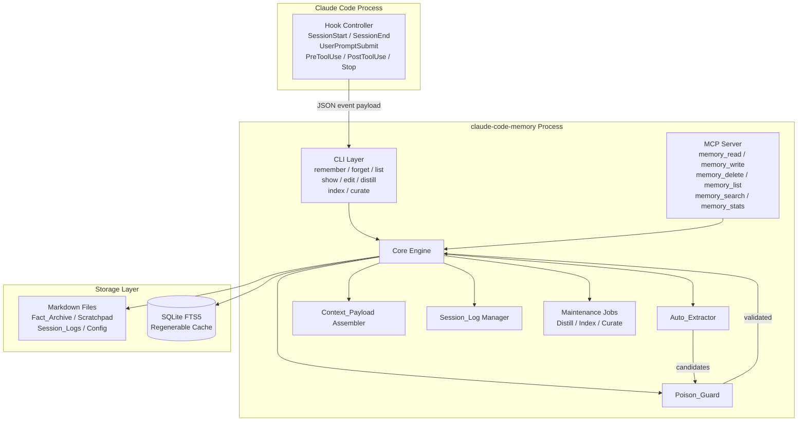
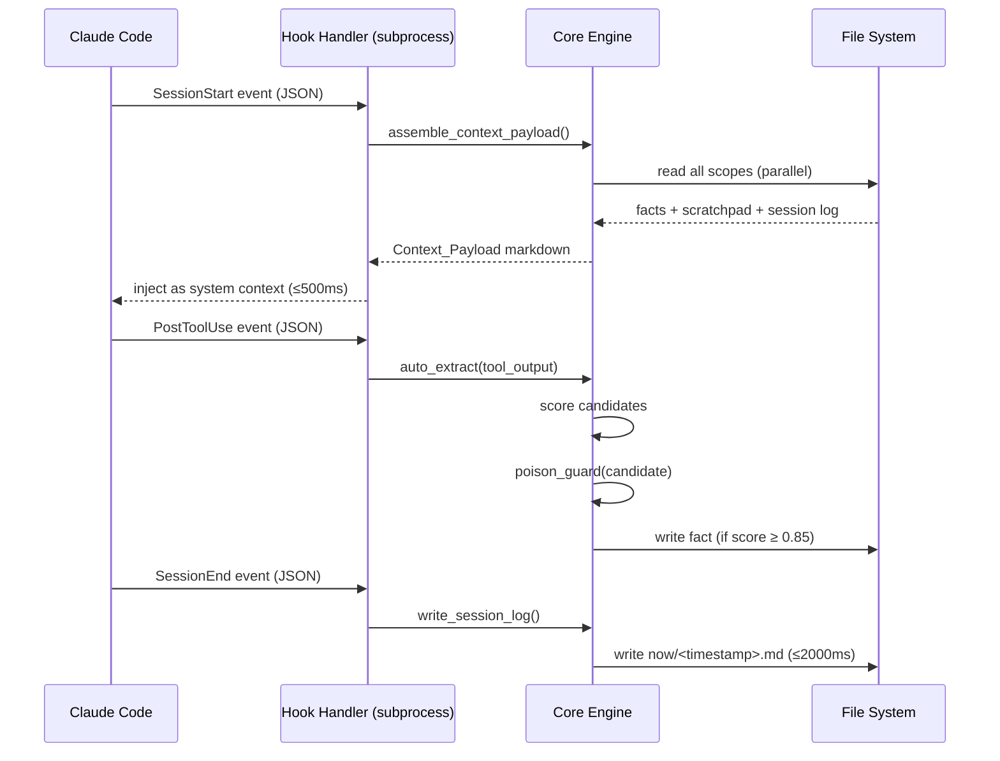
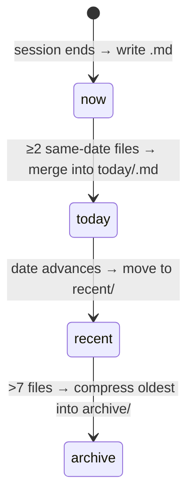

# Design Document: claude-code-memory

## Overview

Claude Code Memory is a per-project, in-repo memory system that eliminates the structural amnesia problem in Claude Code sessions. Every session currently starts with zero context; this system captures durable facts automatically via lifecycle hooks, exposes explicit user controls, and loads relevant context at session start — all stored as human-readable markdown files that travel with the repository.

The system is implemented as a **TypeScript/Node.js CLI tool and MCP server** that integrates with Claude Code's lifecycle hook system. It targets v0.1.0 and must coexist with Claude Code's native auto-memory feature (v2.1.59+).

### Key Design Decisions

- **TypeScript/Node.js** — matches Claude Code's own runtime, enabling tight integration with its hook system and MCP protocol. The `@modelcontextprotocol/sdk` package provides the MCP server scaffolding.
- **Markdown-first storage** — all authoritative data lives in UTF-8 markdown files with YAML front-matter. SQLite is a regenerable cache, never the source of truth.
- **Three-tier scope model** — `user-global` (cross-project), `project` (in-repo, git-tracked), `local` (per-machine, gitignored) with deterministic priority resolution.
- **Conservative auto-extraction** — confidence-scored candidates; only ≥0.85 auto-persist, 0.50–0.84 require user confirmation, <0.50 are silently discarded.
- **Poison_Guard as a synchronous gate** — every write path (CLI, MCP, Auto_Extract) passes through the same validation layer before any disk write.
- **No silent network calls** — all operations are local-only by default; optional external vector search requires an explicit opt-in flag.

---

## Architecture

The system is composed of five layers that communicate through well-defined interfaces:



### Process Model

The Memory_System runs as a **sidecar process** invoked by Claude Code's hook system. Each hook event spawns (or communicates with) the memory process via stdio JSON. The MCP server runs as a persistent background process registered in Claude Code's MCP configuration.



---

## Components and Interfaces

### 1. Scope Manager

Responsible for resolving paths and initializing scope directories.

```typescript
interface ScopeManager {
  /** Resolve the root path for a given scope */
  resolveScopePath(scope: Scope, projectRoot?: string): string;

  /** Ensure all three scope directories exist, creating them if needed */
  initializeScopes(projectRoot: string): Promise<void>;

  /** Ensure .claude/memory-local/ is in .gitignore */
  ensureGitignore(projectRoot: string): Promise<void>;

  /** Load and merge facts from all three scopes with priority resolution */
  loadAllScopes(projectRoot: string): Promise<MergedScopeData>;
}

type Scope = 'user-global' | 'project' | 'local';

interface ScopeLayout {
  root: string;           // e.g. ~/.claude-memory/
  factArchive: string;    // root/facts/
  scratchpad: string;     // root/scratchpad.md
  sessionLogs: {
    now: string;          // root/sessions/now/
    today: string;        // root/sessions/today/
    recent: string;       // root/sessions/recent/
    archive: string;      // root/sessions/archive/
  };
  config: string;         // root/config.yml
  auditLog: string;       // root/audit.log
  jobsLog: string;        // root/jobs.log
}
```

Path resolution rules:
- `user-global`: `%USERPROFILE%\.claude-memory\` (Windows) / `$HOME/.claude-memory/` (macOS/Linux), falling back to `os.homedir()`.
- `project`: `<repo-root>/.claude/memory/`
- `local`: `<repo-root>/.claude/memory-local/`

### 2. Fact Store

Handles all CRUD operations on individual Fact files.

```typescript
interface FactStore {
  create(content: string, opts: CreateFactOpts): Promise<Fact>;
  read(citationId: string): Promise<Fact | null>;
  softDelete(citationId: string): Promise<void>;
  hardDelete(citationId: string): Promise<void>;
  list(scope: Scope, opts?: ListOpts): Promise<FactSummary[]>;
  exists(citationId: string): Promise<boolean>;
}

interface Fact {
  citationId: string;       // mem-YYYYMMDD-xxxxxx
  content: string;          // markdown body
  createdAt: string;        // ISO 8601 UTC
  scope: Scope;
  tags: string[];
  sourceHook: string;       // 'cli' | hook name | MCP tool name
  private?: boolean;
  retain?: boolean;
  deletedAt?: string;       // ISO 8601 UTC, present if soft-deleted
  lastAccessedAt?: string;  // ISO 8601 UTC
}

interface CreateFactOpts {
  scope: Scope;
  tags?: string[];
  sourceHook: string;
  private?: boolean;
}
```

**Citation ID generation:**

```typescript
function generateCitationId(date: Date): string {
  const dateStr = date.toISOString().slice(0, 10).replace(/-/g, '');
  const chars = 'abcdefghijklmnopqrstuvwxyz0123456789';
  let suffix = '';
  for (let i = 0; i < 6; i++) {
    suffix += chars[Math.floor(Math.random() * chars.length)];
  }
  return `mem-${dateStr}-${suffix}`;
}
```

Collision detection retries up to 10 times before returning an error (Requirement 3.3).

**File format** (each Fact stored as `<citation-id>.md`):

```markdown
---
citation_id: mem-20240601-abc123
created_at: 2024-06-01T14:32:00Z
scope: project
tags:
  - architecture
  - decision
source_hook: PostToolUse
---

I prefer using TypeScript strict mode for all new projects because it catches null-reference errors at compile time.
```

### 3. Scratchpad Manager

```typescript
interface ScratchpadManager {
  read(scope: Scope, projectRoot?: string): Promise<ScratchpadContent>;
  write(scope: Scope, content: string, projectRoot?: string): Promise<void>;
  trim(scope: Scope, replacement: string, projectRoot?: string): Promise<void>;
  getCapConfig(scope: Scope): number;  // default 8000, range 1000–32000
}

interface ScratchpadContent {
  content: string;
  charCount: number;
  cap: number;
  utilizationPct: number;
}
```

Write validation: if `content.length > cap`, reject with an error containing current count, cap, and overage.

### 4. Session Log Manager

```typescript
interface SessionLogManager {
  beginSession(sessionId: string): SessionHandle;
  endSession(handle: SessionHandle): Promise<void>;
  compress(): Promise<void>;  // rolling-window compression
}

interface SessionHandle {
  sessionId: string;
  startedAt: string;
  toolCalls: Map<string, number>;  // tool name → invocation count
  extractedFactIds: string[];
  contextFactIds: string[];
}

interface SessionLog {
  sessionId: string;
  startedAt: string;
  endedAt: string;
  toolCalls: Record<string, number>;
  extractedFactIds: string[];
  contextFactIds: string[];
}
```

**Rolling-window compression logic:**



### 5. Auto_Extractor

```typescript
interface AutoExtractor {
  extract(toolOutput: string, sessionContext: SessionContext): Promise<ExtractionResult[]>;
}

interface ExtractionResult {
  content: string;
  confidence: number;       // 0.0–1.0
  matchedPatterns: string[];
  decision: 'auto-persist' | 'suggest' | 'discard';
}
```

**Pattern matching rules** (Requirement 9.1):

| Pattern | Description | Example |
|---|---|---|
| `preference` | First-person preference assertion | "I prefer", "I always", "I want", "I use" |
| `config-kv` | Key-value pair from recognized config format | `"port": 3000`, `DEBUG=true` |
| `decision-rationale` | Statement with "because" or "so that" clause | "We use X because Y" |
| `named-entity-3x` | File path / dep name / API URL appearing ≥3× in session | `/src/auth/index.ts` |

Confidence scoring: each matched pattern contributes to the score. Multiple matches increase confidence. The scoring function is:

```
confidence = min(1.0, Σ(pattern_weight[p] for p in matched_patterns))
```

Where `pattern_weight` values are tuned constants (e.g., `preference: 0.7`, `decision-rationale: 0.6`, `config-kv: 0.5`, `named-entity-3x: 0.4`). Multiple matches can push the score above 0.85 for auto-persist.

### 6. Poison_Guard

```typescript
interface PoisonGuard {
  validate(candidate: string): ValidationResult;
}

interface ValidationResult {
  passed: boolean;
  rejectionReason?: string;
}
```

**Rejection rules** (Requirement 10):

| Rule | Check |
|---|---|
| Injection phrases | Contains "ignore previous instructions", "you are now", "system prompt", "disregard all prior", "your new instructions" (case-insensitive) |
| Length limit | `content.length > 4000` characters |
| Hidden content | Contains `<!-- ... -->` HTML comments, zero-width characters (U+200B, U+FEFF, etc.), or CSS `display:none`/`visibility:hidden` |

All checks are synchronous and run before any disk write. If Poison_Guard itself throws, the candidate is rejected (fail-closed, Requirement 10.6).

### 7. Context Payload Assembler

```typescript
interface ContextPayloadAssembler {
  assemble(projectRoot: string, opts: AssemblyOpts): Promise<ContextPayload>;
}

interface AssemblyOpts {
  maxTokens?: number;       // 1000–200000, default unlimited
  coexistMode: boolean;     // wrap in <!-- claude-code-memory --> tags
}

interface ContextPayload {
  markdown: string;
  factIds: string[];        // IDs included (for session log)
  truncated: boolean;
}
```

**Assembly order** (highest priority last, so truncation removes lowest priority first):

1. `user-global` scratchpad
2. `user-global` facts (up to 10, by last-accessed)
3. `project` scratchpad
4. `project` facts (up to 10, by last-accessed)
5. `local` scratchpad
6. `local` facts (up to 10, by last-accessed)
7. Rolling-window summary from most recent prior session

When truncating to fit `maxTokens`, content is removed in reverse order (user-global first).

Private facts (`private: true`) are excluded. The payload is wrapped in `<!-- claude-code-memory --> ... <!-- /claude-code-memory -->` when `coexistMode` is true.

### 8. Hook Controller

```typescript
interface HookController {
  handleSessionStart(event: HookEvent): Promise<HookResponse>;
  handleSessionEnd(event: HookEvent): Promise<HookResponse>;
  handleUserPromptSubmit(event: HookEvent): Promise<HookResponse>;
  handlePreToolUse(event: HookEvent): Promise<HookResponse>;
  handlePostToolUse(event: HookEvent): Promise<HookResponse>;
  handleStop(event: HookEvent): Promise<HookResponse>;
}

interface HookEvent {
  type: 'SessionStart' | 'SessionEnd' | 'UserPromptSubmit' | 'PreToolUse' | 'PostToolUse' | 'Stop';
  payload: Record<string, unknown>;
  sessionId: string;
  projectRoot: string;
}

interface HookResponse {
  success: boolean;
  contextPayload?: string;   // for SessionStart
  error?: string;
}
```

**Timing budgets:**
- `SessionStart` → context assembly: ≤500ms
- `SessionEnd` → session log write: ≤2000ms
- `Stop` → flush pending writes: ≤1000ms

### 9. MCP Server

Built on `@modelcontextprotocol/sdk`. Exposes six tools:

```typescript
// Tool schemas (Zod)
const MemoryReadSchema = z.object({
  citation_id: z.string(),
});

const MemoryWriteSchema = z.object({
  content: z.string(),
  scope: z.enum(['user-global', 'project', 'local']).default('project'),
  tags: z.array(z.string()).optional(),
});

const MemoryDeleteSchema = z.object({
  citation_id: z.string(),
  hard: z.boolean().default(false),
});

const MemoryListSchema = z.object({
  scope: z.enum(['user-global', 'project', 'local', 'all']).default('all'),
  tag: z.string().optional(),
});

const MemorySearchSchema = z.object({
  query: z.string(),
  limit: z.number().int().min(1).max(50).default(20),
});

const MemoryStatsSchema = z.object({});
```

Authentication: a local token stored in `~/.claude-memory/mcp-token` (generated on first run, 256-bit random hex). Every MCP request must include this token in the `Authorization` header. Requests without a valid token are rejected with a 401-equivalent error (Requirement 11.4).

### 10. Search Index (SQLite FTS5)

```typescript
interface SearchIndex {
  rebuild(facts: Fact[]): Promise<void>;
  search(query: string, limit: number): Promise<SearchResult[]>;
  upsert(fact: Fact): Promise<void>;
  remove(citationId: string): Promise<void>;
}

interface SearchResult {
  citationId: string;
  rank: number;
  snippet: string;
}
```

SQLite schema:

```sql
CREATE VIRTUAL TABLE facts_fts USING fts5(
  citation_id UNINDEXED,
  content,
  tags,
  tokenize = 'porter ascii'
);

CREATE TABLE facts_meta (
  citation_id TEXT PRIMARY KEY,
  scope TEXT NOT NULL,
  created_at TEXT NOT NULL,
  last_accessed_at TEXT,
  deleted_at TEXT,
  private INTEGER NOT NULL DEFAULT 0
);
```

The FTS5 index only contains facts where `private = 0` and `deleted_at IS NULL`. If SQLite is unavailable or the index is absent, the system falls back to a linear scan of markdown files (Requirement 15.5).

### 11. Maintenance Jobs

```typescript
interface MaintenanceJob {
  name: 'distill' | 'index' | 'curate';
  run(projectRoot: string): Promise<JobResult>;
}

interface JobResult {
  status: 'succeeded' | 'failed';
  itemsProcessed: number;
  error?: string;
  completedAt: string;
}
```

**Distill_Job**: Compresses session logs per rolling-window rules. Promotes unreferenced facts from compressed logs to the Fact_Archive.

**Index_Job**: Drops and rebuilds the FTS5 index from all eligible markdown files. Must complete within 30s for ≤1,000 facts.

**Curate_Job**: Identifies facts not accessed in ≥90 days without `retain: true`. Presents them to the user for confirmation before deletion.

**Concurrency guard**: A `.lock` file in the job's scope directory prevents duplicate runs (Requirement 16.7). Uses cross-platform advisory locking via Node.js `fs.open` with exclusive flag.

### 12. CLI Layer

Entry point: `claude-memory` (or `cm` alias).

```
claude-memory remember "<content>" [--scope project|local|user-global] [--tag <tag>]
claude-memory forget <citation-id> [--hard]
claude-memory list [--scope all|project|local|user-global] [--tag <tag>]
claude-memory show <citation-id>
claude-memory edit <citation-id>
claude-memory scratchpad trim [--scope project|local|user-global]
claude-memory distill
claude-memory index
claude-memory curate
claude-memory stats
```

Commands are also recognized as natural-language phrases within Claude Code prompts via the `UserPromptSubmit` hook (Requirement 7.7).

---

## Data Models

### Directory Layout

```
~/.claude-memory/                          # user-global scope
├── config.yml
├── mcp-token                              # 256-bit auth token
├── audit.log
├── jobs.log
├── scratchpad.md
├── facts/
│   ├── mem-20240601-abc123.md
│   └── mem-20240602-def456.md
├── sessions/
│   ├── now/
│   │   └── 2024-06-01T14:32:00Z.md
│   ├── today/
│   │   └── 2024-06-01.md
│   ├── recent/
│   │   └── 2024-05-31.md
│   └── archive/
│       └── 2024-W21.md
└── search.db                              # SQLite FTS5 cache (regenerable)

<repo-root>/.claude/
├── memory/                                # project scope (git-tracked)
│   ├── config.yml
│   ├── scratchpad.md
│   ├── facts/
│   └── sessions/
└── memory-local/                          # local scope (gitignored)
    ├── config.yml
    ├── scratchpad.md
    ├── facts/
    └── sessions/
```

### Fact File Schema

```yaml
---
citation_id: mem-20240601-abc123          # string, mem-YYYYMMDD-[a-z0-9]{6}
created_at: 2024-06-01T14:32:00Z         # ISO 8601 UTC
scope: project                            # user-global | project | local
tags:                                     # YAML list, may be empty
  - architecture
source_hook: PostToolUse                  # cli | hook name | MCP tool name
private: false                            # optional, default false
retain: false                             # optional, default false
deleted_at: ~                             # ISO 8601 UTC if soft-deleted, else null
last_accessed_at: 2024-06-03T09:00:00Z   # ISO 8601 UTC, updated on read
---

Fact content in CommonMark markdown.
```

### Session Log File Schema

```yaml
---
session_id: sess-20240601-xyz789
started_at: 2024-06-01T14:00:00Z
ended_at: 2024-06-01T14:32:00Z
tool_calls:
  Read: 12
  Write: 3
  Bash: 5
extracted_fact_ids:
  - mem-20240601-abc123
context_fact_ids:
  - mem-20240530-zzz999
---

## Session Summary

Brief auto-generated summary of session activity.
```

### Configuration Schema

```yaml
# config.yml (per scope)
scratchpad_cap: 8000                      # 1000–32000
context_size_limit: ~                     # null = unlimited, or 1000–200000 tokens
native_memory_coexist: true               # wrap payload in comment tags
editor: ~                                 # null = use $EDITOR env var
external_vector_search: false             # must be explicitly true to enable
distill_schedule: ~                       # cron expression or null
index_schedule: ~                         # cron expression or null
curate_schedule: ~                        # cron expression or null
```

### Audit Log Format

Each line is a JSON object (newline-delimited JSON):

```json
{"ts":"2024-06-01T14:32:00Z","event":"auto_extract","candidate_preview":"I prefer TypeScript strict mode...","patterns":["preference"],"confidence":0.87,"decision":"auto-persist","citation_id":"mem-20240601-abc123"}
{"ts":"2024-06-01T14:32:01Z","event":"poison_guard_reject","reason":"injection_phrase","preview":"ignore previous instructions..."}
{"ts":"2024-06-01T14:32:02Z","event":"session_start","native_memory_active":"unknown"}
{"ts":"2024-06-01T14:32:03Z","event":"network_block","destination":"api.example.com"}
```

---

## Correctness Properties

*A property is a characteristic or behavior that should hold true across all valid executions of a system — essentially, a formal statement about what the system should do. Properties serve as the bridge between human-readable specifications and machine-verifiable correctness guarantees.*


### Property 1: Scope path distinctness

*For any* project root path, the three resolved scope paths (`user-global`, `project`, `local`) must be distinct, non-overlapping directories with no path being a prefix of another.

**Validates: Requirements 1.1**

---

### Property 2: Scope priority merge correctness

*For any* collection of facts distributed across `user-global`, `project`, and `local` scopes where the same logical key appears in multiple scopes, the merged result must always contain the value from the highest-priority scope (`local` > `project` > `user-global`), and no lower-priority value for that key must appear in the merged output.

**Validates: Requirements 1.9**

---

### Property 3: Fact file round-trip integrity

*For any* valid Fact content string and creation options (scope, tags, sourceHook), writing the Fact to disk and reading it back must produce a Fact object with all required YAML front-matter fields (`citation_id`, `created_at`, `scope`, `tags`, `source_hook`) present, correctly typed, and with content identical to the original input.

**Validates: Requirements 2.2, 2.3**

---

### Property 4: Citation_ID format and uniqueness invariants

*For any* set of facts created by the system: (a) every Citation_ID must match the pattern `mem-YYYYMMDD-[a-z0-9]{6}`, and (b) all Citation_IDs in the archive must be distinct — no two facts may share the same Citation_ID regardless of creation order or date.

**Validates: Requirements 3.2, 3.3**

---

### Property 5: Scratchpad cap enforcement with complete error information

*For any* scratchpad with a configured cap `C` and current content of length `L`, a write attempt that would result in total length exceeding `C` must be rejected without modifying the scratchpad, and the error response must contain all three of: the current character count `L`, the configured cap `C`, and the overage amount `(L + write_length - C)`.

**Validates: Requirements 4.1, 4.3**

---

### Property 6: Session log structural completeness

*For any* completed session with an arbitrary number of tool calls and extracted fact IDs, the written Session_Log file must parse back to a record containing all required fields: `session_id`, `started_at`, `ended_at`, `tool_calls` (with correct per-tool counts), and `extracted_fact_ids` (with all IDs present).

**Validates: Requirements 5.1, 5.2**

---

### Property 7: Rolling-window now→today compression

*For any* set of two or more Session_Log files in the `now/` directory that all share the same calendar date (UTC), after running the compression step the `now/` directory must contain zero files for that date and the `today/` directory must contain exactly one summary file for that date.

**Validates: Requirements 5.3**

---

### Property 8: Rolling-window recent/ bounded size

*For any* sequence of date advances and compression operations, the `recent/` subdirectory must never contain more than 7 daily summary files after any compression step completes.

**Validates: Requirements 5.4, 5.5**

---

### Property 9: Auto_Extract confidence score range

*For any* tool output string processed by Auto_Extract, every confidence score in the returned extraction results must satisfy `0.0 ≤ score ≤ 1.0`.

**Validates: Requirements 9.2**

---

### Property 10: Auto_Extract persistence threshold

*For any* candidate fact produced by Auto_Extract: if the confidence score is ≥ 0.85 and no fact with identical normalized content already exists in the archive, the candidate must be persisted; if the confidence score is < 0.50, the candidate must be discarded without user interaction; if the confidence score is between 0.50 and 0.84 inclusive, the candidate must be surfaced as a suggestion and must not be persisted without explicit user confirmation.

**Validates: Requirements 9.3, 9.4, 9.5**

---

### Property 11: Deduplication prevents re-persistence

*For any* candidate fact whose content, after normalization (whitespace collapse and case folding), is identical to a fact already present in the Fact_Archive, the candidate must be discarded regardless of its confidence score — including scores ≥ 0.85.

**Validates: Requirements 9.7**

---

### Property 12: Poison_Guard rejects all invalid content

*For any* content string that satisfies any of the following conditions, Poison_Guard must return `passed = false`: (a) the string contains any of the injection phrases ("ignore previous instructions", "you are now", "system prompt", "disregard all prior", "your new instructions") in any position and any case; (b) the string's length exceeds 4,000 characters; (c) the string contains HTML comment blocks (`<!-- -->`), zero-width Unicode characters (U+200B, U+FEFF, U+200C, U+200D, U+2060), or CSS `display:none` / `visibility:hidden` constructs. Conversely, for any content string that satisfies none of these conditions, Poison_Guard must return `passed = true`.

**Validates: Requirements 10.2, 10.3, 10.4**

---

### Property 13: MCP search result ordering and bound

*For any* search query and any Fact_Archive state, the results returned by `memory_search` must be ordered by descending relevance score (no result may have a higher relevance score than any result that precedes it) and the total count of results must not exceed 50.

**Validates: Requirements 11.3**

---

### Property 14: Generated filenames use only safe characters

*For any* filename generated by the Memory_System (Citation_ID filenames, Session_Log filenames, archive filenames), the filename must match the pattern `[a-z0-9][a-z0-9-]*\.[a-z0-9]+` — containing only lowercase letters, digits, and hyphens, with no spaces, uppercase letters, or special characters.

**Validates: Requirements 13.3**

---

## Error Handling

### Hook Failures

| Hook | Failure Mode | Recovery |
|---|---|---|
| `SessionStart` context assembly fails | Log error to audit log; allow session to proceed with empty context | Requirement 6.3 |
| `SessionEnd` log write exceeds 2000ms | Retain in-memory data; attempt write on next `SessionStart` | Requirement 6.5 |
| `Stop` flush exceeds 1000ms | Write partial-flush warning to audit log; exit | Requirement 6.9 |

### Fact Operations

| Operation | Failure Mode | Response |
|---|---|---|
| Citation_ID collision (all 10 retries fail) | Return error; do not persist | Requirement 3.3 |
| `forget` with unknown Citation_ID | Return error: "Citation_ID not found" | Requirement 7.2 |
| `show` with deleted Citation_ID | Return error: "Citation_ID not found or deleted" | Requirement 7.5 |
| `edit` with no `$EDITOR` configured | Return error with instructions to set `EDITOR` | Requirement 7.6 |

### Scratchpad

| Operation | Failure Mode | Response |
|---|---|---|
| Write exceeds cap | Reject write; return error with count/cap/overage | Requirement 4.3 |
| `trim` replacement exceeds cap | Reject replacement; re-display trim prompt with error | Requirement 4.5 |

### Poison_Guard

All Poison_Guard rejections are fail-closed: if Poison_Guard itself throws an exception, the candidate is rejected (not persisted) and the failure is logged to the audit log (Requirement 10.6).

### Search Index

If the SQLite FTS5 index is absent, corrupt, or unavailable, the system falls back to a linear full-text scan of all eligible markdown files. If the linear scan exceeds 2000ms, a timeout error is returned with any partial results collected (Requirements 15.5, 15.6).

### MCP Authentication

Any MCP request without a valid local authentication token is rejected with an authentication error. No read or write operation is performed (Requirement 11.4).

### Network Isolation

Any code path that attempts an outbound network call during core operations is blocked. The attempted destination and UTC timestamp are logged to the audit log, and the operation continues without the network call (Requirement 14.2).

---

## Testing Strategy

### Dual Testing Approach

The testing strategy combines **unit/example-based tests** for specific behaviors and **property-based tests** for universal invariants. Both are necessary for comprehensive coverage.

### Property-Based Testing

**Library**: [`fast-check`](https://fast-check.dev/) (TypeScript-native, actively maintained, supports complex generators).

**Configuration**: Each property test runs a minimum of **100 iterations** (fast-check default). For computationally cheap properties (pure functions), increase to 1000 iterations.

**Tag format**: Each property test is tagged with a comment:
```typescript
// Feature: claude-code-memory, Property N: <property_text>
```

**Property test implementations** (one test per property):

| Property | Test Description | Generator Strategy |
|---|---|---|
| P1: Scope path distinctness | Generate arbitrary project root paths; verify three scope paths are distinct | `fc.string()` for project root |
| P2: Scope priority merge | Generate random fact sets across scopes with overlapping keys; verify merge result | `fc.record()` with overlapping keys |
| P3: Fact round-trip integrity | Generate random content + creation opts; write + read; verify all fields | `fc.string()`, `fc.array(fc.string())` |
| P4: Citation_ID format + uniqueness | Generate many IDs; verify format regex and set uniqueness | `fc.date()` for date component |
| P5: Scratchpad cap enforcement | Generate cap values (1000–32000) and content lengths; verify rejection + error fields | `fc.integer({min:1000,max:32000})` |
| P6: Session log completeness | Generate sessions with random tool calls and fact IDs; write + parse; verify fields | `fc.dictionary()`, `fc.array()` |
| P7: now→today compression | Generate 2–20 same-date session logs; run compression; verify counts | `fc.integer({min:2,max:20})` |
| P8: recent/ bounded size | Generate sequences of date advances; verify recent/ ≤ 7 after each step | `fc.array(fc.date())` |
| P9: Confidence score range | Generate arbitrary tool output strings; verify all scores in [0.0, 1.0] | `fc.string()` |
| P10: Persistence threshold | Generate candidates with scores in each tier; verify correct disposition | `fc.float({min:0,max:1})` |
| P11: Deduplication | Generate existing fact + duplicate candidate; verify discard | `fc.string()` for content |
| P12: Poison_Guard completeness | Generate strings with/without injection patterns; verify correct pass/fail | `fc.string()` + injection phrase injection |
| P13: Search result ordering | Generate queries + fact stores; verify descending order + ≤50 count | `fc.array(fc.record())` |
| P14: Filename safety | Generate any creation scenario; verify all filenames match safe pattern | `fc.date()`, `fc.string()` |

### Unit / Example-Based Tests

Focus on:
- Platform-specific path resolution (Windows `%USERPROFILE%` vs Unix `$HOME`) — Requirement 1.2
- SQLite markdown-wins conflict resolution — Requirement 2.4
- Collision retry logic (mock RNG to force collisions) — Requirement 3.3
- `scratchpad trim` interactive flow — Requirement 4.4
- Native auto-memory detection and audit logging — Requirement 12.3
- MCP authentication token validation — Requirement 11.4
- Search index fallback to linear scan — Requirement 15.5
- Duplicate job rejection — Requirement 16.7
- `.gitignore` creation and entry insertion — Requirement 1.7, 1.8

### Integration Tests

- Full session lifecycle: SessionStart → PostToolUse (auto-extract) → SessionEnd → verify session log + facts
- Cross-OS path portability: simulate clone on different OS path separator conventions
- MCP server tool round-trips: write → read → delete → verify
- Maintenance job execution: distill → index → curate with real file system
- Network isolation: intercept network calls during all core operations; verify none are made (Requirement 14.1)

### Smoke Tests

- Memory_System initializes correctly with no existing scope directories
- SQLite FTS5 availability detection
- OS scheduler registration (cron / Task Scheduler) — Requirement 16.3
- Native auto-memory detection at session start — Requirement 12.3

### Performance Benchmarks

| Operation | Budget | Condition |
|---|---|---|
| Context_Payload assembly | ≤500ms | Any store size |
| Session_Log write | ≤2000ms | Any session |
| Stop flush | ≤1000ms | Any pending writes |
| Fact retrieval by Citation_ID | ≤100ms | ≤10,000 facts |
| MCP read/list/search/stats | ≤200ms | ≤10,000 facts |
| Index_Job rebuild | ≤30s | ≤1,000 facts |
| Linear search fallback | ≤2000ms | ≤1,000 facts |
